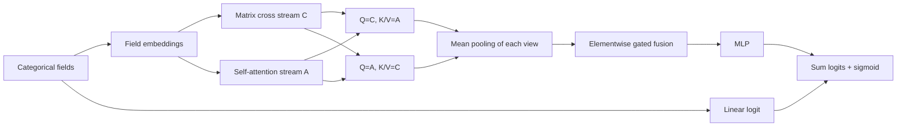

# CAFIN: new research design v1

The user requested an explicitly documented new design because no original
Criteo CAFIN code is available. This supersedes the earlier requirement to wait
for that code. **This is not a reproduction of an existing Criteo implementation.**
Architecture choices below are our working design, not verified properties of
the original model, and do not establish novelty or superior performance.

## Exact forward computation

Let the batch field embeddings be E in R^(B x m x d). Each field uses a disjoint
part of the embedding table. A separate first-order term is shared in form by
every ablation: linear(x) = bias + sum_j w_j(x_j).

1. **Explicit cross stream.** Flatten E to x0 in R^(B x md). For L cross layers:
   `x_(l+1) = x0 * (W_l x_l + b_l) + x_l`.
   Each W_l is a full md-by-md matrix (the DCNv2-style matrix cross operation).
   Reshape the last vector to B x m x d and apply LayerNorm across d to obtain C.
2. **Context stream.** A0 = E. Each layer computes
   `A_(l+1) = LayerNorm(A_l + Dropout(MHA(A_l, A_l, A_l)))`.
   PyTorch MHA uses scaled dot-product attention and learned Q/K/V/output
   projections. There is no Transformer feed-forward sublayer or positional
   embedding. Fields are already represented by separate embedding parameters.
3. **Parallel bidirectional cross-attention.** Independently compute
   `Z_CA = LayerNorm(C + Dropout(MHA_CA(Q=C, K=A, V=A)))` and
   `Z_AC = LayerNorm(A + Dropout(MHA_AC(Q=A, K=C, V=C)))`.
   Both read the original C/A. The reverse direction does not read Z_CA.
   Directions have distinct parameters; none share the context-stream MHA.
4. **Pooling.** u = mean_fields(Z_CA), v = mean_fields(Z_AC), each B x d.
5. **Fusion.** `g = sigmoid(W_g [u;v] + b_g)`; `h = g*u + (1-g)*v`.
   Gate is elementwise, not a single scalar. It is not an explanation of causal
   feature importance.
6. **Head.** `logit = linear(x) + MLP(h)`. MLP uses configurable ReLU hidden
   layers and dropout. BCEWithLogitsLoss consumes logits; inference applies sigmoid.

Defaults: d=16, two cross layers, two context layers, two attention heads,
dropout=0.1, MLP=[128,64]. These are starting hyperparameters, not tuned findings.

## Ablations implemented in the same pipeline

| Model name | Streams | Cross-attention | MLP input |
|---|---|---|---|
| CAFIN_DNN | Embeddings only | None | mean(E) |
| CAFIN_CrossOnly | C only | None | mean(C) |
| CAFIN_AttentionOnly | A only | None | mean(A) |
| CAFIN_Concat | C and A | None | Linear_2d_to_d([mean(C);mean(A)]) |
| CAFIN_CrossAttention | C and A | Both directions | Linear_2d_to_d([u;v]) |
| CAFIN | C and A | Both directions | g*u + (1-g)*v |

Every row includes the same form of first-order path and d-dimensional MLP head.
Concat projection and gate both have 2d^2+d parameters. This makes the A4/full
fusion comparison matched in parameter count, though the operations differ.
Other ablations remove parameters; report total/embedding/non-embedding
parameters, runtime and GPU memory rather than claiming globally equal capacity.

`CAFIN_DNN` is a pooled-embedding control, NOT the standalone DNN baseline, which
flattens all embeddings. `CAFIN_CrossOnly` is NOT the standalone DCNv2 baseline,
which uses a parallel MLP and a different head. Retain these names in paper tables.
Every ablation is independently trained on the same splits/seeds.

## Relationship to prior methods and missing original source

- AutoInt is the comparison for attentive field interactions. This CAFIN design
  exchanges information between two representations; that alone does not
  establish a novel mechanism.
- DCNv2 motivates the explicit full-matrix cross operation used here.
- Parallel interaction families motivate comparison with DeepFM and xDeepFM.
  Cross-attention and gating are established techniques.
- The original CAFIN cross module, direction, gate, norm and loss remain unknown.
  We cannot enumerate factual differences from its missing implementation.
  We list the choices made here and mark the provenance honestly.

## Complexity and reproducibility

The full matrix cross stream costs O(L (md)^2), with L full matrices; attention
has field-pair terms O(m^2 d), projection costs, and two extra cross-attention
modules. High-cardinality embedding/optimizer states may dominate memory.
No class weighting, focal loss, calibrator, pretrained embedding or field-group
prior is silently enabled.

Each CAFIN run archives the architecture manifest and source/config hashes. A
test-unlocked run cannot be trained again. To change architecture, create a new
version, configs, sweep plan and run directories.

## Evidence still required

Real-data baseline tuning; five-seed comparison; ablation stability; per-campaign
and season results; CTR-to-RTB utility; and a current literature audit. Until then,
call this a proposed implementation, not novel, SOTA, or an online improvement.
